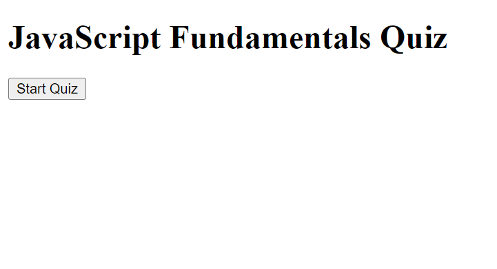

# Code-Quiz

# Description

This code quiz consists of 4 questions related to coding topics. User has 60 seconds to answer all questions to earn a highscore. When user incorrectly guesses 10 seconds will be deducted from the time. All corrects questions do not effect the time. Once timer runs out or all questions have been answered their will be a text box to put your initials. Once initials are entered your score will be saved to local storage. Highscores are ranked highest to lowest.

# Installation

git clone https://github.com/BPouliot1/Code-Quiz.git

# Usage

Open index.html file and click start quiz

# Visuals 

Live Website https://bpouliot1.github.io/Code-Quiz/ 

